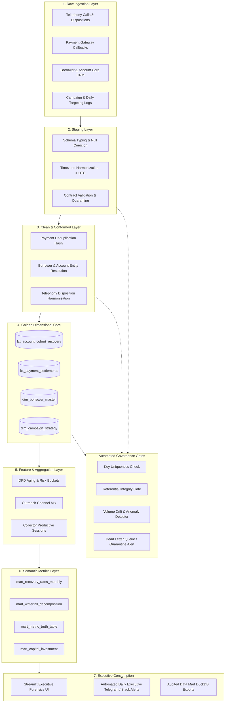

# Production Analytics System Architecture & Engineering Design

This document details the end-to-end technical specification for operating the CRED RESOLVE Forensics Platform in daily production.

---

## 1. End-to-End Data Pipeline Flow

---

## 2. Engineering Specifications

### 2.1 Data Contracts & Schema Validation
Every upstream source system must adhere to a strict semantic contract. Ingestion uses JSON Schema / dbt contracts:
- `payments`: Requires unique `payment_reference`, positive numeric `amount`, recognized `payment_status` enum (`SUCCESS`, `PENDING`, `FAILED`, `REVERSED`), and ISO-8601 UTC timestamp `event_at`.
- `daily_targeting`: Requires non-null `account_id`, non-null `target_date`, valid `campaign_id` foreign key.
- `borrowers`: Requires non-null `borrower_id`, valid mobile number format, and monotonic `updated_at`.
- **Violation Policy:** Malformed payloads fail validation and are routed to a Dead-Letter Queue (`data/quarantine/`) with PagerDuty alerts without interrupting golden pipeline execution.

### 2.2 Primary Keys & Entity Resolution Hierarchy
| Layer | Entity Fact / Dimension | Primary Key | Key Strategy |
| :--- | :--- | :--- | :--- |
| **Clean** | Borrowers | `borrower_id` | SCD Type 1 with latest `updated_at` winning resolution |
| **Clean** | Payments | `payment_id` | Unique `payment_reference` or deterministic SHA-256 hash |
| **Clean** | Calls | `call_id` | Surrogate key from vendor call session ID |
| **Golden**| Account Cohort Fact | `account_id` + `month` | Composite natural key at monthly resolution |
| **Marts** | Monthly Recovery Mart | `month` | ISO-8601 Date format (`YYYY-MM-01`) |

### 2.3 Semantic Metric Definitions & Versioning
All business metrics are stored in code as versioned SQL queries (`sql/03_metric_calculations.sql`) with explicit semantic definition IDs:
- **`REC-01` (Audited Recovery Rate):** $\frac{\text{Distinct accounts with settled payment in 30-day window}}{\text{Total eligible accounts assigned at month start}}$
- **`REC-02` (Legacy Contacted Rate):** $\frac{\text{Distinct contacted accounts with settled payment}}{\text{Total accounts successfully contacted in month}}$
- **`PTP-01` (PTP Kept Rate):** $\frac{\text{PTPs settled on or before promised due date}}{\text{Total valid PTP promises recorded}}$
- **`CST-01` (Cost per Rupee Recovered):** $\frac{\text{Fully loaded operating costs (telephony + digital + agency)}}{\text{Total net settled recovery amount}}$

### 2.4 Incremental Processing & Late-Arriving Data
1. **Partitioning:** The lakehouse/warehouse is partitioned by `month` and `target_date`.
2. **Watermarking & Late Data:** Late-arriving payments (e.g. offline bank clearances, weekend RTGS callbacks) are accepted with a **30-day trailing watermark**.
3. **Idempotency:** When late events arrive, the pipeline idempotently re-executes the affected monthly cohort partition (`INSERT OVERWRITE` or DuckDB table swaps) rather than appending duplicates.

### 2.5 Backfills & Historical Schema Evolution
- Re-running transformations from historical snapshots is fully reproducible because source raw files are write-once, append-only.
- Schema changes (e.g. vendor disposition code migrations) are isolated in Staging view adapters, shielding downstream marts from breaking structural changes.

### 2.6 Data Quality Checks & Automated Gates
- **Critical Acceptance Gates (Pipeline Halts):**
  - Duplicate keys in golden tables $> 0$.
  - Negative payment amounts or corrupted monetary sums.
  - Referential integrity: $> 0.1\%$ orphan account IDs.
- **Warning Gates (Pipeline Continues, Visible Dashboard Banner):**
  - Incomplete month data ($< 25$ days observed).
  - Monthly assigned eligible population drift $> 20\%$.
  - Unmapped vendor disposition codes $> 1\%$.

### 2.7 Monitoring, Anomaly Detection & Alerting
1. **Volume Drift:** Daily record count is compared against a 14-day rolling median. Deviations exceeding $3\times\sigma$ trigger Slack/Telegram operational warnings.
2. **Missingness Drift:** Automated checks detect sudden spikes in `NULL` rates in critical fields (`payment_reference`, `borrower_id`).
3. **Conversion Anomaly:** Sudden daily spikes ($> 2.5\times$ baseline) in settlement amounts trigger automated fraud and webhook retry audits before executive publication.
