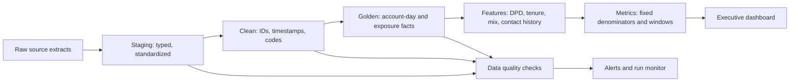

# Production architecture

Each source has a declared primary key and freshness SLA. Loads are idempotent by source event ID; late-arriving events update the affected account-day partitions and recompute the trailing 90 days. Historical dimensions are SCD2 rather than overwritten. Metrics are versioned with a semantic definition ID so leadership can see when logic changes.

Minimum checks: uniqueness, referential integrity, non-negative monetary values, event timestamps within plausible bounds, payment-to-account match, duplicate payment hash, daily row-count drift, missingness drift, and denominator continuity. A failed critical check blocks publication; warning checks publish with a visible status.
